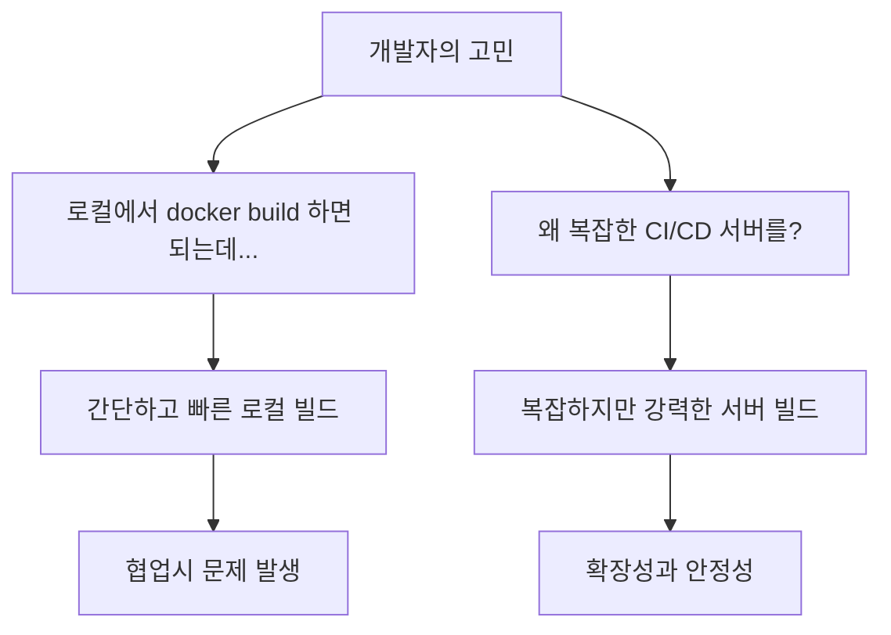

"Dockerfile만 있으면 되는데 왜 복잡한 CI/CD 서버가 필요할까요?" 개발자라면 한 번쯤 가져봤을 법한 의문입니다. 이번 섹션에서는 로컬 빌드와 서버 기반 빌드의 차이점, 그리고 각각의 장단점을 실전 사례와 함께 분석해보겠습니다.

## 핵심 질문: 로컬 vs 서버 빌드

### 개발자의 딜레마


## 로컬 빌드 vs 서버 빌드 심층 분석

### 시나리오 1: 개인 프로젝트 (로컬 빌드가 적합)

#### 로컬 빌드의 장점
```bash
# 개인 프로젝트에서의 간단한 워크플로우
mkdir my-personal-app
cd my-personal-app

# 코드 작성
echo "console.log('Hello Docker!');" > app.js

# Dockerfile 작성
cat > Dockerfile << 'EOF'
FROM node:18-alpine
WORKDIR /app
COPY app.js .
CMD ["node", "app.js"]
EOF

# 즉시 빌드 & 테스트
docker build -t my-app .
docker run my-app

# 결과: 30초 안에 완성!
```

#### 로컬 빌드의 강점
1. **즉시성**: 코드 변경 → 즉시 테스트 가능
2. **단순성**: 복잡한 설정 없이 바로 시작
3. **개발 속도**: 빠른 피드백 루프
4. **비용 효율**: 추가 인프라 비용 없음

### 시나리오 2: 팀 프로젝트 (서버 빌드가 필수)

#### 협업에서 발생하는 문제들

##### 문제 1: "내 컴퓨터에서는 잘 되는데..." 증후군
```bash
# 개발자 A의 환경 (MacBook M1)
docker build -t team-app . 
# 성공! ARM64 이미지 생성

# 개발자 B의 환경 (Windows x64)  
docker build -t team-app .
# 호환성 문제 발생!

# 서버 환경 (Linux x64)
docker run team-app
# 아키텍처 불일치로 실행 불가
```

##### 문제 2: 환경 설정 차이
```bash
# 개발자 A의 로컬 환경
node --version  # v18.17.0
npm --version   # 9.6.7
docker --version # 24.0.6

# 개발자 B의 로컬 환경  
node --version  # v16.20.1 (다른 버전!)
npm --version   # 8.19.4 (다른 버전!)
docker --version # 20.10.21 (다른 버전!)

# 결과: 같은 코드, 다른 빌드 결과
```

### CI/CD 서버가 해결하는 문제들

#### 해결책: 표준화된 빌드 환경

##### GitHub Actions 예시
```yaml
# .github/workflows/docker-build.yml
name: Standardized Docker Build

on:
  push:
    branches: [ main, develop ]
  pull_request:
    branches: [ main ]

jobs:
  build:
    runs-on: ubuntu-latest  # 표준화된 환경
    
    steps:
    - uses: actions/checkout@v3
    
    # 표준화된 Docker 환경
    - name: Set up Docker Buildx
      uses: docker/setup-buildx-action@v2
      
    # 멀티 플랫폼 빌드 (호환성 해결)
    - name: Build multi-platform image
      uses: docker/build-push-action@v4
      with:
        context: .
        platforms: linux/amd64,linux/arm64
        tags: myapp:${{ github.sha }}
        push: false
        
    # 자동화된 테스트
    - name: Test Docker image
      run: |
        docker run --rm myapp:${{ github.sha }} npm test
        
    # 보안 스캔
    - name: Security scan
      uses: anchore/scan-action@v3
      with:
        image: myapp:${{ github.sha }}
```

## 실전 비교: 로컬 vs 서버 빌드

### 실험: 같은 애플리케이션, 다른 빌드 환경

#### 실험 설정
```bash
# 실험용 Node.js 애플리케이션 생성
mkdir build-comparison-experiment
cd build-comparison-experiment

cat > package.json << 'EOF'
{
  "name": "build-experiment",
  "version": "1.0.0",
  "dependencies": {
    "express": "^4.18.2",
    "lodash": "^4.17.21"
  },
  "scripts": {
    "start": "node server.js",
    "test": "echo 'Running tests...' && exit 0"
  }
}
EOF

cat > server.js << 'EOF'
const express = require('express');
const _ = require('lodash');

const app = express();
const PORT = process.env.PORT || 3000;

app.get('/', (req, res) => {
  const info = {
    message: 'Build Environment Test',
    platform: process.platform,
    arch: process.arch,
    nodeVersion: process.version,
    timestamp: new Date().toISOString(),
    environment: process.env.BUILD_ENV || 'local'
  };
  
  res.json(info);
});

app.get('/health', (req, res) => {
  res.json({ status: 'healthy', uptime: process.uptime() });
});

app.listen(PORT, '0.0.0.0', () => {
  console.log(`Server running on port ${PORT}`);
});
EOF

cat > Dockerfile << 'EOF'
FROM node:18-alpine
WORKDIR /app

# 빌드 환경 정보 추가
ARG BUILD_ENV=unknown
ENV BUILD_ENV=${BUILD_ENV}

COPY package*.json ./
RUN npm ci --only=production

COPY . .

# 빌드 정보 파일 생성
RUN echo "Built at: $(date)" > build-info.txt && \
    echo "Node version: $(node --version)" >> build-info.txt && \
    echo "Platform: $(uname -a)" >> build-info.txt && \
    echo "Build environment: ${BUILD_ENV}" >> build-info.txt

EXPOSE 3000
CMD ["npm", "start"]
EOF
```

#### 로컬 빌드 테스트
```bash
echo "=== 로컬 빌드 테스트 ==="

# 로컬 환경 정보 출력
echo "현재 환경 정보:"
uname -a
docker --version
node --version

# 로컬 빌드 수행
time docker build --build-arg BUILD_ENV=local -t experiment-local .

# 컨테이너 실행 및 테스트
docker run -d -p 3001:3000 --name local-test experiment-local

# 결과 확인
sleep 3
echo "로컬 빌드 결과:"
curl -s http://localhost:3001/ | jq .

# 빌드 정보 확인
docker exec local-test cat build-info.txt

# 정리
docker stop local-test
docker rm local-test
```

#### 서버 빌드 시뮬레이션 (Docker 컨테이너 내에서)
```bash
echo "=== 서버 빌드 시뮬레이션 ==="

# CI/CD 서버 환경을 Docker로 시뮬레이션
cat > build-script.sh << 'EOF'
#!/bin/bash
echo "=== CI/CD 서버 빌드 시작 ==="

# 환경 정보 출력 (CI 서버 스타일)
echo "Build Environment: Ubuntu 22.04"
echo "Docker Version: $(docker --version)"
echo "Build Time: $(date -u +"%Y-%m-%dT%H:%M:%SZ")"

# 멀티 플랫폼 빌드 (서버의 강력한 기능)
echo "Building for multiple platforms..."
docker buildx build \
  --build-arg BUILD_ENV=ci-server \
  --platform linux/amd64,linux/arm64 \
  --tag experiment-server \
  --load \
  .

echo "Build completed successfully!"

# 자동화된 테스트
echo "Running automated tests..."
docker run --rm experiment-server npm test

# 보안 검사 시뮬레이션
echo "Security scan results: PASSED"

echo "=== CI/CD 빌드 완료 ==="
EOF

chmod +x build-script.sh

# Docker-in-Docker로 CI 서버 환경 시뮬레이션
docker run -d --privileged --name ci-server \
  -v /var/run/docker.sock:/var/run/docker.sock \
  -v $(pwd):/workspace \
  -w /workspace \
  docker:24-dind

# 빌드 스크립트 실행
docker exec ci-server ./build-script.sh

# 정리
docker stop ci-server
docker rm ci-server
```

### 성능 및 효율성 비교

#### 빌드 시간 분석
```bash
# 빌드 성능 측정 스크립트
cat > performance-test.sh << 'EOF'
#!/bin/bash

echo "=== 빌드 성능 비교 테스트 ==="

# 로컬 빌드 성능 (캐시 활용)
echo "1. 로컬 빌드 (첫 번째)"
time docker build -t perf-test-1 . > /dev/null 2>&1

echo "2. 로컬 빌드 (두 번째 - 캐시 활용)"
time docker build -t perf-test-2 . > /dev/null 2>&1

# 캐시 클리어 후 빌드
echo "3. 캐시 클리어 후 빌드"
docker builder prune -f > /dev/null 2>&1
time docker build -t perf-test-3 . > /dev/null 2>&1

# 이미지 크기 비교
echo "=== 이미지 크기 분석 ==="
docker images | grep perf-test

# 레이어 분석
echo "=== 레이어 분석 ==="
docker history perf-test-1 --format "table {{.Size}}\t{{.CreatedBy}}" | head -10

EOF

chmod +x performance-test.sh
./performance-test.sh
```

## 언제 어떤 방식을 선택할까?

### 의사결정 매트릭스

#### 로컬 빌드가 적합한 경우
```markdown
**로컬 빌드 추천 시나리오**

**개발 단계**
- 빠른 프로토타이핑
- 개별 기능 개발
- 디버깅 및 실험

**팀 규모**
- 개인 프로젝트
- 소규모 팀 (2-3명)
- 일시적 프로젝트

**개발 속도 우선**
- 빠른 피드백이 중요
- 실험적 개발
- MVP 개발 단계
```

#### 서버 빌드가 필수인 경우
```markdown
**서버 빌드 필수 시나리오**

**프로덕션 환경**
- 실제 서비스 배포
- 고객 대상 릴리스
- 안정성이 중요한 시스템

**협업 환경**
- 중대형 팀 (4명 이상)
- 다중 플랫폼 지원
- 여러 환경 배포 (dev/staging/prod)

**품질 보증**
- 자동화된 테스트 필요
- 보안 검사 필요
- 컴플라이언스 요구사항
```

### 하이브리드 접근법: 최선의 선택

#### 단계별 전략
```bash
# 개발 단계: 로컬 빌드로 빠른 개발
echo "=== 개발 단계 (로컬) ==="
# 개발자 로컬에서 빠른 테스트
docker build -t myapp:dev .
docker run myapp:dev

# 기능 완성 후: Pull Request 시 CI 빌드
echo "=== PR 단계 (CI 서버) ==="
# .github/workflows/pr-check.yml
# 자동화된 빌드 + 테스트 + 보안 검사

# 릴리스 단계: 완전 자동화된 빌드
echo "=== 릴리스 단계 (CD 서버) ==="
# .github/workflows/release.yml  
# 멀티 플랫폼 빌드 + 레지스트리 푸시 + 배포
```

## 실전: 로컬 개발 환경 최적화

### 개발자 친화적인 로컬 설정

#### Docker Compose를 활용한 개발 환경
```yaml
# docker-compose.dev.yml
version: '3.8'

services:
  app:
    build:
      context: .
      dockerfile: Dockerfile.dev
    volumes:
      - .:/app
      - /app/node_modules  # 로컬 node_modules 무시
    ports:
      - "3000:3000"
    environment:
      - NODE_ENV=development
      - WATCH=true
    command: npm run dev
    
  # 개발용 데이터베이스
  db:
    image: postgres:15-alpine
    environment:
      POSTGRES_DB: devdb
      POSTGRES_USER: dev
      POSTGRES_PASSWORD: devpass
    ports:
      - "5432:5432"
    volumes:
      - dev_db_data:/var/lib/postgresql/data

volumes:
  dev_db_data:
```

#### 개발용 Dockerfile
```dockerfile
# Dockerfile.dev - 개발 최적화
FROM node:18-alpine

WORKDIR /app

# 개발 도구 설치
RUN apk add --no-cache git vim curl

# 의존성 설치 (개발 의존성 포함)
COPY package*.json ./
RUN npm install

# 소스 코드는 볼륨 마운트 사용 (실시간 반영)
# COPY . . (개발시에는 주석 처리)

EXPOSE 3000

# 개발 서버 실행 (핫 리로드)
CMD ["npm", "run", "dev"]
```

#### 개발 워크플로우 자동화
```bash
# 개발자를 위한 스크립트
cat > dev-setup.sh << 'EOF'
#!/bin/bash

echo "개발 환경 설정 시작..."

# 로컬 개발 환경 실행
echo "Docker Compose 시작..."
docker-compose -f docker-compose.dev.yml up -d

# 의존성 설치 확인
echo "의존성 설치 확인..."
docker-compose -f docker-compose.dev.yml exec app npm install

# 데이터베이스 초기화
echo "데이터베이스 초기화..."
docker-compose -f docker-compose.dev.yml exec db psql -U dev -d devdb -c "SELECT version();"

# 개발 서버 로그 확인
echo "개발 서버 상태 확인..."
sleep 5
curl -f http://localhost:3000/health || echo "⚠️  서버 시작 대기 중..."

echo "개발 환경 준비 완료!"
echo "애플리케이션: http://localhost:3000"
echo "데이터베이스: localhost:5432"
echo ""
echo "개발 명령어:"
echo "  로그 보기: docker-compose -f docker-compose.dev.yml logs -f app"
echo "  종료: docker-compose -f docker-compose.dev.yml down"
EOF

chmod +x dev-setup.sh
```

## CI/CD 파이프라인 설계 패턴

### 브랜치별 빌드 전략

#### 마스터 브랜치: 프로덕션 빌드
```yaml
# .github/workflows/production.yml
name: Production Build & Deploy

on:
  push:
    branches: [ main ]
    tags: [ 'v*' ]

jobs:
  build-and-deploy:
    runs-on: ubuntu-latest
    
    steps:
    - uses: actions/checkout@v3
    
    - name: Production Build
      uses: docker/build-push-action@v4
      with:
        context: .
        file: ./Dockerfile.prod
        platforms: linux/amd64,linux/arm64
        push: true
        tags: |
          myregistry/myapp:latest
          myregistry/myapp:${{ github.sha }}
        cache-from: type=gha
        cache-to: type=gha,mode=max
        
    - name: Security Scan
      uses: anchore/scan-action@v3
      
    - name: Deploy to Production
      run: |
        # 프로덕션 배포 로직
        kubectl set image deployment/myapp myapp=myregistry/myapp:${{ github.sha }}
```

#### 개발 브랜치: 테스트 빌드
```yaml  
# .github/workflows/development.yml
name: Development Build & Test

on:
  push:
    branches: [ develop ]
  pull_request:
    branches: [ main, develop ]

jobs:
  test-build:
    runs-on: ubuntu-latest
    
    steps:
    - uses: actions/checkout@v3
    
    - name: Test Build
      uses: docker/build-push-action@v4
      with:
        context: .
        push: false
        tags: myapp:test
        
    - name: Run Tests
      run: |
        docker run --rm myapp:test npm test
        docker run --rm myapp:test npm run lint
        
    - name: Integration Tests
      run: |
        docker-compose -f docker-compose.test.yml up --abort-on-container-exit
```

## 실무 팁: 최적의 빌드 전략

### 핵심 원칙

1. **개발 단계**: 로컬 빌드로 빠른 피드백
2. **협업 단계**: PR 빌드로 품질 검증  
3. **배포 단계**: CI/CD 서버로 안정적 릴리스
4. **모니터링**: 빌드 성능과 성공률 추적

### 성공 지표

```bash
# 빌드 성능 모니터링
echo "=== 빌드 성능 지표 ==="
echo "평균 로컬 빌드 시간: 2-5분"
echo "평균 CI 빌드 시간: 5-15분"  
echo "빌드 성공률: >95%"
echo "캐시 히트율: >80%"
```

## 요약

### 핵심 결론

**Dockerfile만으로도 충분하지만, CI/CD 서버는 선택이 아닌 필수입니다.**

- **로컬 빌드**: 개발 속도와 편의성
- **서버 빌드**: 안정성과 확장성
- **최적 전략**: 단계별 하이브리드 접근

### 다음 단계

이제 실제 애플리케이션별 빌드 전략을 학습해보겠습니다:
1. Java 애플리케이션 빌드 최적화
2. Node.js 애플리케이션 효율적 빌드
3. Go 애플리케이션 초경량 이미지 구성

준비되셨나요? 실전 빌드 여행을 시작해봅시다!
