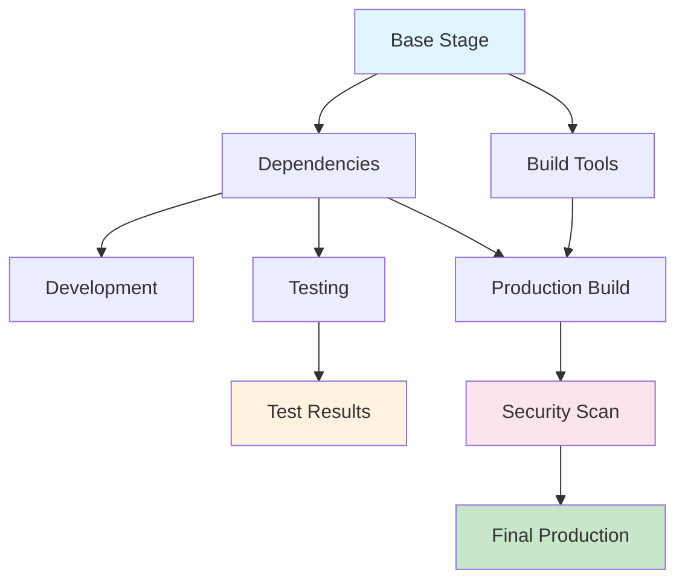

멀티스테이지 빌드는 Docker의 가장 강력한 기능 중 하나입니다. 이번 섹션에서는 **실제 프로덕션 환경에서 사용되는 고급 패턴들**을 학습하고, 복잡한 애플리케이션을 위한 **최적화된 빌드 전략**을 마스터하겠습니다.

## 고급 멀티스테이지 아키텍처

### 복잡한 스테이지 구조 예시



## 실습 1: 풀스택 애플리케이션 멀티스테이지

### 복잡한 프로젝트 구조

```bash
# 풀스택 프로젝트 생성
mkdir fullstack-multistage
cd fullstack-multistage

# 프로젝트 구조 생성
mkdir -p {frontend/{src,public},backend/{src,tests},shared,scripts,docs,configs}

# Frontend (React + TypeScript)
cat > frontend/package.json << 'EOF'
{
  "name": "fullstack-frontend",
  "version": "1.0.0",
  "private": true,
  "dependencies": {
    "react": "^18.2.0",
    "react-dom": "^18.2.0",
    "typescript": "^5.2.2",
    "axios": "^1.5.0",
    "@types/react": "^18.2.22",
    "@types/react-dom": "^18.2.7"
  },
  "scripts": {
    "build": "react-scripts build",
    "test": "react-scripts test",
    "eject": "react-scripts eject"
  },
  "devDependencies": {
    "react-scripts": "5.0.1",
    "@testing-library/jest-dom": "^5.16.4",
    "@testing-library/react": "^13.4.0"
  },
  "browserslist": {
    "production": [
      ">0.2%",
      "not dead",
      "not op_mini all"
    ],
    "development": [
      "last 1 chrome version",
      "last 1 firefox version",
      "last 1 safari version"
    ]
  }
}
EOF

# Backend (Node.js + Express)
cat > backend/package.json << 'EOF'
{
  "name": "fullstack-backend",
  "version": "1.0.0",
  "main": "dist/server.js",
  "scripts": {
    "build": "tsc",
    "start": "node dist/server.js",
    "dev": "ts-node src/server.ts",
    "test": "jest"
  },
  "dependencies": {
    "express": "^4.18.2",
    "cors": "^2.8.5",
    "dotenv": "^16.3.1",
    "helmet": "^7.0.0"
  },
  "devDependencies": {
    "typescript": "^5.2.2",
    "@types/express": "^4.17.17",
    "@types/cors": "^2.8.13",
    "@types/node": "^20.5.0",
    "ts-node": "^10.9.1",
    "jest": "^29.6.2",
    "@types/jest": "^29.5.4"
  }
}
EOF

# Shared 패키지
cat > shared/package.json << 'EOF'
{
  "name": "fullstack-shared",
  "version": "1.0.0",
  "main": "dist/index.js",
  "types": "dist/index.d.ts",
  "scripts": {
    "build": "tsc",
    "test": "jest"
  },
  "devDependencies": {
    "typescript": "^5.2.2",
    "jest": "^29.6.2"
  }
}
EOF
```

### 고급 멀티스테이지 Dockerfile

```dockerfile
# syntax=docker/dockerfile:1.4

# ===================================
# Stage 1: 베이스 이미지 준비
# ===================================
FROM node:18-alpine AS base

# 전역 의존성 설치
RUN apk add --no-cache \
    git \
    python3 \
    make \
    g++ \
    curl \
    && npm install -g pnpm@8

# 작업 디렉토리 설정
WORKDIR /app

# ===================================
# Stage 2: 의존성 설치 (공통)
# ===================================
FROM base AS dependencies

# package.json 파일들을 먼저 복사 (캐시 최적화)
COPY package.json pnpm-lock.yaml* ./
COPY frontend/package.json ./frontend/
COPY backend/package.json ./backend/
COPY shared/package.json ./shared/

# 의존성 설치 (레이어 캐싱 활용)
RUN --mount=type=cache,target=/root/.npm \
    --mount=type=cache,target=/root/.cache/pnpm \
    pnpm install --frozen-lockfile

# ===================================
# Stage 3: 개발 환경
# ===================================
FROM dependencies AS development

# 소스 코드 복사
COPY . .

# 개발용 설정
ENV NODE_ENV=development
EXPOSE 3000 3001

# 개발 서버 시작
CMD ["pnpm", "dev"]

# ===================================
# Stage 4: 테스트 환경
# ===================================
FROM dependencies AS testing

# 테스트용 소스 코드 복사
COPY . .

# 테스트 실행
RUN --mount=type=cache,target=/root/.cache/pnpm \
    pnpm run test:ci

# 테스트 결과를 별도 스테이지로 저장
FROM scratch AS test-results
COPY --from=testing /app/coverage /coverage
COPY --from=testing /app/test-results /test-results

# ===================================
# Stage 5: Shared 라이브러리 빌드
# ===================================
FROM dependencies AS shared-build

COPY shared/ ./shared/
WORKDIR /app/shared

RUN pnpm run build

# ===================================
# Stage 6: Frontend 빌드
# ===================================
FROM dependencies AS frontend-build

# Shared 라이브러리 복사
COPY --from=shared-build /app/shared/dist ./shared/dist

# Frontend 소스 복사 및 빌드
COPY frontend/ ./frontend/
WORKDIR /app/frontend

# 환경변수 설정
ARG REACT_APP_API_URL=http://localhost:3001
ARG REACT_APP_VERSION=1.0.0
ENV REACT_APP_API_URL=$REACT_APP_API_URL
ENV REACT_APP_VERSION=$REACT_APP_VERSION

# 빌드 실행
RUN --mount=type=cache,target=/root/.cache/pnpm \
    pnpm run build

# 빌드 결과 확인
RUN ls -la build/ && du -sh build/

# ===================================
# Stage 7: Backend 빌드
# ===================================
FROM dependencies AS backend-build

# Shared 라이브러리 복사
COPY --from=shared-build /app/shared/dist ./shared/dist

# Backend 소스 복사 및 빌드
COPY backend/ ./backend/
WORKDIR /app/backend

# TypeScript 컴파일
RUN pnpm run build

# 프로덕션 의존성만 설치
RUN --mount=type=cache,target=/root/.cache/pnpm \
    pnpm install --prod --frozen-lockfile

# ===================================
# Stage 8: 보안 스캔
# ===================================
FROM backend-build AS security-scan

# 보안 취약점 스캔
RUN pnpm audit --audit-level moderate || true

# 추가 보안 도구 (선택사항)
# RUN npx retire --js --node --exitwith 0

# ===================================
# Stage 9: 프로덕션 백엔드
# ===================================
FROM node:18-alpine AS production-backend

# 보안 강화
RUN addgroup -g 1001 -S nodejs && \
    adduser -S backend -u 1001

# 런타임 의존성
RUN apk add --no-cache tini

WORKDIR /app

# 필수 파일만 복사
COPY --from=backend-build --chown=backend:nodejs /app/backend/dist ./dist
COPY --from=backend-build --chown=backend:nodejs /app/backend/package.json ./
COPY --from=backend-build --chown=backend:nodejs /app/backend/node_modules ./node_modules

# 사용자 전환
USER backend

# 헬스체크
HEALTHCHECK --interval=30s --timeout=3s --start-period=5s --retries=3 \
    CMD wget --no-verbose --tries=1 --spider http://localhost:3001/health || exit 1

EXPOSE 3001

# Tini를 사용한 신호 처리
ENTRYPOINT ["tini", "--"]
CMD ["node", "dist/server.js"]

# ===================================
# Stage 10: 프로덕션 Frontend (Nginx)
# ===================================
FROM nginx:alpine AS production-frontend

# Nginx 설정
COPY configs/nginx.conf /etc/nginx/nginx.conf
COPY configs/default.conf /etc/nginx/conf.d/default.conf

# 빌드된 정적 파일 복사
COPY --from=frontend-build /app/frontend/build /usr/share/nginx/html

# 권한 설정
RUN chown -R nginx:nginx /usr/share/nginx/html && \
    chmod -R 755 /usr/share/nginx/html

# 헬스체크
HEALTHCHECK --interval=30s --timeout=3s --retries=3 \
    CMD wget --no-verbose --tries=1 --spider http://localhost:80/health || exit 1

EXPOSE 80

CMD ["nginx", "-g", "daemon off;"]

# ===================================
# Stage 11: 개발용 올인원
# ===================================
FROM base AS dev-allinone

COPY --from=dependencies /app/node_modules ./node_modules
COPY . .

# 개발 서버들을 병렬로 실행
CMD ["sh", "-c", "cd frontend && pnpm start & cd backend && pnpm run dev & wait"]

# ===================================
# Stage 12: 프로덕션 올인원 (데모용)
# ===================================
FROM nginx:alpine AS production-allinone

# Node.js 런타임 추가
RUN apk add --no-cache nodejs npm tini

# Nginx 설정
COPY configs/nginx-allinone.conf /etc/nginx/nginx.conf

# Frontend 정적 파일
COPY --from=frontend-build /app/frontend/build /usr/share/nginx/html

# Backend 애플리케이션
COPY --from=backend-build /app/backend/dist /app/backend/
COPY --from=backend-build /app/backend/node_modules /app/node_modules/
COPY --from=backend-build /app/backend/package.json /app/

# 실행 스크립트
COPY scripts/start-allinone.sh /start.sh
RUN chmod +x /start.sh

EXPOSE 80

ENTRYPOINT ["tini", "--"]
CMD ["/start.sh"]
```

### Nginx 설정 파일들

```bash
# configs/nginx.conf
cat > configs/nginx.conf << 'EOF'
user nginx;
worker_processes auto;
error_log /var/log/nginx/error.log warn;
pid /var/run/nginx.pid;

events {
    worker_connections 1024;
    use epoll;
    multi_accept on;
}

http {
    include /etc/nginx/mime.types;
    default_type application/octet-stream;
    
    # 로그 포맷
    log_format main '$remote_addr - $remote_user [$time_local] "$request" '
                    '$status $body_bytes_sent "$http_referer" '
                    '"$http_user_agent" "$http_x_forwarded_for" '
                    'rt=$request_time uct="$upstream_connect_time" '
                    'uht="$upstream_header_time" urt="$upstream_response_time"';
    
    access_log /var/log/nginx/access.log main;
    
    # 성능 최적화
    sendfile on;
    tcp_nopush on;
    tcp_nodelay on;
    keepalive_timeout 65;
    types_hash_max_size 2048;
    
    # Gzip 압축
    gzip on;
    gzip_vary on;
    gzip_min_length 1024;
    gzip_types
        text/plain
        text/css
        text/xml
        text/javascript
        application/javascript
        application/xml+rss
        application/json;
    
    # 보안 헤더
    add_header X-Frame-Options "SAMEORIGIN" always;
    add_header X-XSS-Protection "1; mode=block" always;
    add_header X-Content-Type-Options "nosniff" always;
    add_header Referrer-Policy "no-referrer-when-downgrade" always;
    
    include /etc/nginx/conf.d/*.conf;
}
EOF

# configs/default.conf
cat > configs/default.conf << 'EOF'
upstream backend {
    server production-backend:3001 max_fails=3 fail_timeout=30s;
}

server {
    listen 80;
    server_name localhost;
    
    root /usr/share/nginx/html;
    index index.html index.htm;
    
    # 헬스체크
    location /health {
        access_log off;
        return 200 "healthy\n";
        add_header Content-Type text/plain;
    }
    
    # API 프록시
    location /api/ {
        proxy_pass http://backend/api/;
        proxy_set_header Host $host;
        proxy_set_header X-Real-IP $remote_addr;
        proxy_set_header X-Forwarded-For $proxy_add_x_forwarded_for;
        proxy_set_header X-Forwarded-Proto $scheme;
        
        # 타임아웃 설정
        proxy_connect_timeout 30s;
        proxy_send_timeout 30s;
        proxy_read_timeout 30s;
        
        # 버퍼링
        proxy_buffering on;
        proxy_buffer_size 4k;
        proxy_buffers 8 4k;
    }
    
    # 정적 파일 서빙
    location / {
        try_files $uri $uri/ /index.html;
        
        # 캐시 설정
        location ~* \.(js|css|png|jpg|jpeg|gif|ico|svg)$ {
            expires 1y;
            add_header Cache-Control "public, immutable";
        }
        
        location ~* \.(html|htm)$ {
            expires 5m;
            add_header Cache-Control "public, must-revalidate";
        }
    }
    
    # 보안 설정
    location ~ /\. {
        deny all;
    }
}
EOF
```

## 실습 2: 빌드 캐시 최적화 전략

### BuildKit 고급 기능 활용

```dockerfile
# syntax=docker/dockerfile:1.4

# ===================================
# 캐시 마운트 최적화 예제
# ===================================
FROM node:18-alpine AS cache-optimized

WORKDIR /app

# Package.json 먼저 복사 (의존성 캐시)
COPY package*.json ./

# 캐시 마운트를 활용한 의존성 설치
RUN --mount=type=cache,target=/root/.npm \
    --mount=type=cache,target=/tmp/cache \
    npm ci --cache /tmp/cache

# 소스 코드 복사 (별도 레이어)
COPY . .

# 빌드 캐시 마운트
RUN --mount=type=cache,target=/app/.next/cache \
    npm run build

# ===================================
# SSH 마운트를 활용한 Private Repository
# ===================================
FROM alpine/git AS git-deps

WORKDIR /workspace

# SSH 키를 마운트하여 Private Repo 클론
RUN --mount=type=ssh \
    git clone git@github.com:yourorg/private-lib.git

# ===================================
# Secret 마운트를 활용한 보안 빌드
# ===================================
FROM node:18-alpine AS secure-build

WORKDIR /app

COPY package*.json ./

# API 키를 Secret으로 마운트
RUN --mount=type=secret,id=npm_token \
    echo "//registry.npmjs.org/:_authToken=$(cat /run/secrets/npm_token)" > .npmrc && \
    npm ci && \
    rm -f .npmrc
```

### 빌드 스크립트 최적화

```bash
# scripts/build-optimized.sh
cat > scripts/build-optimized.sh << 'EOF'
#!/bin/bash
set -euo pipefail

# 빌드 설정
IMAGE_NAME="fullstack-app"
VERSION=${VERSION:-$(git rev-parse --short HEAD)}
PLATFORM=${PLATFORM:-"linux/amd64,linux/arm64"}

echo "=== 고급 멀티스테이지 빌드 시작 ==="
echo "이미지: $IMAGE_NAME:$VERSION"
echo "플랫폼: $PLATFORM"

# Docker BuildKit 활성화
export DOCKER_BUILDKIT=1

# 빌드 컨텍스트 최적화를 위한 .dockerignore 생성
cat > .dockerignore << 'DOCKERIGNORE'
node_modules
.git
.env*.local
coverage
test-results
*.log
.DS_Store
Thumbs.db
README.md
.gitignore
DOCKERIGNORE

# Buildx 빌더 생성 (한 번만)
docker buildx create --name advanced-builder --use 2>/dev/null || true

# 다양한 타겟 빌드
echo ""
echo "빌드 타겟들:"

# 1. 개발 환경 빌드
echo "  개발 환경 빌드..."
docker buildx build \
    --target development \
    --platform linux/amd64 \
    --tag $IMAGE_NAME:dev \
    --load \
    .

# 2. 테스트 실행 및 결과 추출
echo "  테스트 실행..."
docker buildx build \
    --target test-results \
    --platform linux/amd64 \
    --output type=local,dest=./test-output \
    .

# 3. 프로덕션 백엔드 빌드
echo "  프로덕션 백엔드 빌드..."
docker buildx build \
    --target production-backend \
    --platform $PLATFORM \
    --tag $IMAGE_NAME:backend-$VERSION \
    --tag $IMAGE_NAME:backend-latest \
    --push \
    .

# 4. 프로덕션 프론트엔드 빌드
echo "  프로덕션 프론트엔드 빌드..."
docker buildx build \
    --target production-frontend \
    --platform $PLATFORM \
    --tag $IMAGE_NAME:frontend-$VERSION \
    --tag $IMAGE_NAME:frontend-latest \
    --push \
    .

# 5. 올인원 데모 빌드
echo "  올인원 데모 빌드..."
docker buildx build \
    --target production-allinone \
    --platform linux/amd64 \
    --tag $IMAGE_NAME:allinone-$VERSION \
    --load \
    .

echo ""
echo "빌드 완료!"
echo ""
echo "빌드 결과:"
docker images | grep $IMAGE_NAME

echo ""
echo "테스트 결과:"
if [ -d "./test-output" ]; then
    find ./test-output -name "*.xml" -o -name "*.json" | head -5
fi

echo ""
echo "실행 명령어:"
echo "  개발: docker run -p 3000:3000 -p 3001:3001 $IMAGE_NAME:dev"
echo "  데모: docker run -p 8080:80 $IMAGE_NAME:allinone-$VERSION"
EOF

chmod +x scripts/build-optimized.sh
```

## 실습 3: 조건부 빌드와 동적 스테이지

### BuildArg를 활용한 동적 빌드

```dockerfile
# syntax=docker/dockerfile:1.4

# ===================================
# 빌드 아규먼트 정의
# ===================================
ARG BUILD_ENV=production
ARG ENABLE_TESTS=false
ARG NODE_VERSION=18
ARG NGINX_VERSION=alpine

# ===================================
# 조건부 베이스 이미지
# ===================================
FROM node:${NODE_VERSION}-alpine AS base-node
FROM nginx:${NGINX_VERSION} AS base-nginx

# ===================================
# 조건부 테스트 스테이지
# ===================================
FROM base-node AS testing-stage
ARG ENABLE_TESTS

# 테스트가 활성화된 경우에만 실행
RUN if [ "$ENABLE_TESTS" = "true" ]; then \
        echo "테스트 환경 설정 중..." && \
        apk add --no-cache chromium; \
    else \
        echo "테스트 건너뛰기"; \
    fi

COPY . .

# 조건부 테스트 실행
RUN if [ "$ENABLE_TESTS" = "true" ]; then \
        npm run test:ci; \
    fi

# ===================================
# 환경별 빌드 최적화
# ===================================
FROM base-node AS build-stage
ARG BUILD_ENV

# 환경별 설정
RUN if [ "$BUILD_ENV" = "development" ]; then \
        echo "개발 환경 빌드"; \
    elif [ "$BUILD_ENV" = "staging" ]; then \
        echo "스테이징 환경 빌드"; \
    else \
        echo "프로덕션 환경 빌드"; \
    fi

COPY package*.json ./

# 환경별 의존성 설치
RUN if [ "$BUILD_ENV" = "development" ]; then \
        npm install; \
    else \
        npm ci --only=production; \
    fi

COPY . .

# 환경별 빌드 명령
RUN if [ "$BUILD_ENV" = "development" ]; then \
        npm run build:dev; \
    elif [ "$BUILD_ENV" = "staging" ]; then \
        npm run build:staging; \
    else \
        npm run build:prod; \
    fi

# ===================================
# 타겟 선택 스테이지
# ===================================
FROM build-stage AS final-stage
ARG BUILD_ENV

# 환경별 최적화 설정
ENV NODE_ENV=${BUILD_ENV}

# 조건부 실행
CMD if [ "$BUILD_ENV" = "development" ]; then \
        npm run start:dev; \
    else \
        npm run start:prod; \
    fi
```

### 동적 빌드 스크립트

```bash
# scripts/conditional-build.sh
cat > scripts/conditional-build.sh << 'EOF'
#!/bin/bash
set -euo pipefail

# 환경 변수 설정
BUILD_ENV=${1:-production}
ENABLE_TESTS=${2:-false}
NODE_VERSION=${3:-18}
PUSH_IMAGE=${4:-false}

IMAGE_NAME="conditional-app"
TAG="${BUILD_ENV}-$(date +%Y%m%d-%H%M%S)"

echo "=== 조건부 빌드 실행 ==="
echo "환경: $BUILD_ENV"
echo "테스트: $ENABLE_TESTS"
echo "Node.js 버전: $NODE_VERSION"
echo "이미지 푸시: $PUSH_IMAGE"

# 빌드 실행
docker buildx build \
    --build-arg BUILD_ENV=$BUILD_ENV \
    --build-arg ENABLE_TESTS=$ENABLE_TESTS \
    --build-arg NODE_VERSION=$NODE_VERSION \
    --target final-stage \
    --tag $IMAGE_NAME:$TAG \
    --tag $IMAGE_NAME:$BUILD_ENV-latest \
    $([ "$PUSH_IMAGE" = "true" ] && echo "--push" || echo "--load") \
    .

echo "빌드 완료: $IMAGE_NAME:$TAG"

# 조건부 테스트 결과 추출
if [ "$ENABLE_TESTS" = "true" ]; then
    echo "테스트 결과 추출 중..."
    docker buildx build \
        --build-arg ENABLE_TESTS=true \
        --target testing-stage \
        --output type=local,dest=./test-results \
        .
fi
EOF

chmod +x scripts/conditional-build.sh
```

## 실습 4: 보안 강화된 멀티스테이지

### 보안 최적화 패턴

```dockerfile
# syntax=docker/dockerfile:1.4

# ===================================
# 보안 강화된 빌드 스테이지
# ===================================
FROM node:18-alpine AS secure-base

# 보안 업데이트
RUN apk upgrade --no-cache && \
    apk add --no-cache dumb-init

# 비특권 사용자 생성
RUN addgroup -g 1001 -S appgroup && \
    adduser -S appuser -u 1001 -G appgroup

# ===================================
# 종속성 보안 검사
# ===================================
FROM secure-base AS security-audit

COPY package*.json ./

# npm audit 실행
RUN npm audit --audit-level high

# 취약점 자동 수정
RUN npm audit fix --force

# ===================================
# 빌드 스테이지 (최소 권한)
# ===================================
FROM secure-base AS secure-build

# 임시 root 권한으로 필요한 도구 설치
RUN apk add --no-cache python3 make g++

USER appuser
WORKDIR /app

# 소유권이 있는 디렉토리에서 작업
COPY --chown=appuser:appgroup package*.json ./
RUN npm ci --only=production

COPY --chown=appuser:appgroup . .
RUN npm run build

# ===================================
# 프로덕션 스테이지 (읽기 전용)
# ===================================
FROM secure-base AS secure-production

# 런타임에 불필요한 패키지 제거
RUN apk del python3 make g++ && \
    rm -rf /var/cache/apk/*

USER appuser
WORKDIR /app

# 필수 파일만 복사
COPY --from=secure-build --chown=appuser:appgroup /app/dist ./dist
COPY --from=secure-build --chown=appuser:appgroup /app/node_modules ./node_modules
COPY --from=secure-build --chown=appuser:appgroup /app/package.json ./

# 읽기 전용 파일 시스템 설정 준비
RUN mkdir -p /tmp/app-tmp && chown appuser:appgroup /tmp/app-tmp

# 보안 설정
ENV NODE_ENV=production
ENV NPM_CONFIG_UPDATE_NOTIFIER=false
ENV NPM_CONFIG_FUND=false

# 헬스체크 (비특권 사용자로)
HEALTHCHECK --interval=30s --timeout=3s --start-period=5s --retries=3 \
    CMD node healthcheck.js || exit 1

EXPOSE 3000

# dumb-init을 사용한 시그널 처리
ENTRYPOINT ["dumb-init", "--"]
CMD ["node", "dist/server.js"]
```

### 런타임 보안 설정

```bash
# scripts/secure-run.sh
cat > scripts/secure-run.sh << 'EOF'
#!/bin/bash

IMAGE_NAME="secure-app:latest"
CONTAINER_NAME="secure-app-container"

echo "=== 보안 강화된 컨테이너 실행 ==="

docker run -d \
    --name $CONTAINER_NAME \
    --user 1001:1001 \
    --read-only \
    --tmpfs /tmp:rw,noexec,nosuid,size=100m \
    --tmpfs /app/logs:rw,noexec,nosuid,size=50m \
    --security-opt no-new-privileges:true \
    --cap-drop ALL \
    --cap-add NET_BIND_SERVICE \
    --memory 256m \
    --memory-swap 256m \
    --cpus="0.5" \
    --pids-limit 100 \
    --restart unless-stopped \
    --health-cmd="node healthcheck.js" \
    --health-interval=30s \
    --health-timeout=3s \
    --health-retries=3 \
    -p 3000:3000 \
    $IMAGE_NAME

echo "보안 컨테이너 실행 완료"
echo "컨테이너 보안 정보:"

# 보안 설정 확인
docker inspect $CONTAINER_NAME | jq '.[0].HostConfig | {
    ReadonlyRootfs: .ReadonlyRootfs,
    SecurityOpt: .SecurityOpt,
    CapDrop: .CapDrop,
    CapAdd: .CapAdd,
    Memory: .Memory,
    CpuQuota: .CpuQuota,
    PidsLimit: .PidsLimit
}'
EOF

chmod +x scripts/secure-run.sh
```

## 실습 5: 빌드 성능 분석 및 최적화

### 빌드 분석 도구

```bash
# scripts/build-analysis.sh
cat > scripts/build-analysis.sh << 'EOF'
#!/bin/bash

IMAGE_NAME="performance-test"

echo "=== Docker 빌드 성능 분석 ==="

# 1. 빌드 시간 측정
echo "빌드 시간 측정..."
start_time=$(date +%s)

docker buildx build \
    --progress=plain \
    --no-cache \
    -t $IMAGE_NAME:analysis \
    . 2>&1 | tee build.log

end_time=$(date +%s)
build_duration=$((end_time - start_time))

echo "총 빌드 시간: ${build_duration}초"

# 2. 각 스테이지별 시간 분석
echo ""
echo "스테이지별 분석:"
grep -E "DONE|CACHED" build.log | \
while read -r line; do
    echo "$line"
done

# 3. 레이어 크기 분석
echo ""
echo "이미지 레이어 분석:"
docker history $IMAGE_NAME:analysis --format "table {{.CreatedBy}}\t{{.Size}}"

# 4. 캐시 효율성 분석
echo ""
echo "캐시 활용 분석:"
cache_hits=$(grep -c "CACHED" build.log || echo "0")
total_steps=$(grep -c "Step" build.log || echo "1")
cache_efficiency=$((cache_hits * 100 / total_steps))

echo "캐시 적중률: ${cache_efficiency}%"

# 5. 최종 이미지 크기 분석
echo ""
echo "최종 이미지 분석:"
docker images $IMAGE_NAME:analysis --format "table {{.Repository}}\t{{.Tag}}\t{{.Size}}\t{{.CreatedAt}}"

# 6. Dive를 사용한 상세 분석 (설치되어 있다면)
if command -v dive &> /dev/null; then
    echo ""
    echo "Dive를 사용한 상세 분석:"
    dive $IMAGE_NAME:analysis --ci
fi

# 7. 최적화 권장사항
echo ""
echo "최적화 권장사항:"
echo "  - 캐시 적중률이 50% 미만이면 Dockerfile 순서 최적화 필요"
echo "  - 각 스테이지가 5분 이상 소요되면 병렬화 고려"
echo "  - 최종 이미지가 100MB 초과시 불필요한 파일 제거 검토"
EOF

chmod +x scripts/build-analysis.sh
```

### 성능 최적화 체크리스트

```bash
# 성능 최적화 가이드
cat > OPTIMIZATION_GUIDE.md << 'EOF'
# Docker 멀티스테이지 빌드 성능 최적화 가이드

## 빌드 속도 최적화

### 레이어 캐싱 최적화
- [ ] 자주 변경되지 않는 파일을 먼저 COPY
- [ ] package.json과 소스 코드를 분리하여 복사
- [ ] .dockerignore로 불필요한 파일 제외
- [ ] 멀티스테이지에서 공통 베이스 이미지 활용

### BuildKit 고급 기능 활용
- [ ] --mount=type=cache로 의존성 캐시
- [ ] --mount=type=bind로 임시 파일 마운트
- [ ] 병렬 빌드 단계 설계
- [ ] 조건부 빌드로 불필요한 단계 건너뛰기

### 네트워크 최적화
- [ ] 멀티스테이지로 빌드 도구와 런타임 분리
- [ ] 경량 베이스 이미지 사용 (alpine, distroless)
- [ ] 의존성 미리 다운로드 및 캐시
- [ ] Registry에서 레이어 재사용 극대화

## 이미지 크기 최적화

### 최종 이미지 최소화
- [ ] scratch 또는 distroless 베이스 이미지
- [ ] 불필요한 파일 및 패키지 제거
- [ ] 정적 링크 바이너리 생성 (Go, Rust 등)
- [ ] 멀티 아키텍처 지원

### 레이어 최적화
- [ ] RUN 명령어 체이닝으로 레이어 수 최소화
- [ ] 임시 파일 같은 레이어에서 정리
- [ ] COPY 명령어 최적화
- [ ] 단계별 불필요한 파일 제거

## 보안 최적화

### 런타임 보안
- [ ] 비루트 사용자로 실행
- [ ] 읽기 전용 파일시스템
- [ ] 최소 권한 부여
- [ ] 보안 스캐닝 통합

### 빌드 시 보안
- [ ] Secret 마운트로 민감 정보 보호
- [ ] 의존성 취약점 스캔
- [ ] 서명된 이미지 사용
- [ ] 빌드 아규먼트 최소화

## 모니터링 및 분석

### 성능 측정
- [ ] 빌드 시간 추적
- [ ] 캐시 적중률 모니터링
- [ ] 이미지 크기 트렌드 분석
- [ ] CI/CD 파이프라인 성능 측정

### 지속적 개선
- [ ] 정기적인 베이스 이미지 업데이트
- [ ] 의존성 버전 관리
- [ ] 빌드 최적화 자동화
- [ ] 성능 회귀 테스트
EOF
```

## 실습 6: CI/CD 통합 최적화

### GitHub Actions 워크플로우

```yaml
# .github/workflows/multistage-build.yml
name: Multistage Docker Build

on:
  push:
    branches: [main, develop]
  pull_request:
    branches: [main]

env:
  REGISTRY: ghcr.io
  IMAGE_NAME: ${{ github.repository }}

jobs:
  build-and-test:
    runs-on: ubuntu-latest
    permissions:
      contents: read
      packages: write
    
    strategy:
      matrix:
        target: [backend, frontend]
        include:
          - target: backend
            port: 3001
            health_endpoint: /health
          - target: frontend
            port: 80
            health_endpoint: /health
    
    steps:
    - name: Checkout
      uses: actions/checkout@v4
    
    - name: Set up Docker Buildx
      uses: docker/setup-buildx-action@v3
      with:
        driver-opts: |
          network=host
    
    - name: Log in to Container Registry
      uses: docker/login-action@v3
      with:
        registry: ${{ env.REGISTRY }}
        username: ${{ github.actor }}
        password: ${{ secrets.GITHUB_TOKEN }}
    
    - name: Extract metadata
      id: meta
      uses: docker/metadata-action@v5
      with:
        images: ${{ env.REGISTRY }}/${{ env.IMAGE_NAME }}
        tags: |
          type=ref,event=branch
          type=ref,event=pr
          type=raw,value={{branch}}-{{sha}}-{{date 'YYYYMMDD'}}-${{ matrix.target }}
          type=raw,value=latest-${{ matrix.target }},enable={{is_default_branch}}
    
    - name: Build and push
      uses: docker/build-push-action@v5
      with:
        context: .
        target: production-${{ matrix.target }}
        platforms: linux/amd64,linux/arm64
        push: true
        tags: ${{ steps.meta.outputs.tags }}
        labels: ${{ steps.meta.outputs.labels }}
        cache-from: type=gha
        cache-to: type=gha,mode=max
        build-args: |
          BUILDTIME=${{ fromJSON(steps.meta.outputs.json).labels['org.opencontainers.image.created'] }}
          VERSION=${{ fromJSON(steps.meta.outputs.json).labels['org.opencontainers.image.version'] }}
    
    - name: Test Docker image
      run: |
        docker run -d --name test-${{ matrix.target }} \
          -p ${{ matrix.port }}:${{ matrix.port }} \
          ${{ env.REGISTRY }}/${{ env.IMAGE_NAME }}:latest-${{ matrix.target }}
        
        # 컨테이너 시작 대기
        sleep 30
        
        # 헬스체크
        curl -f http://localhost:${{ matrix.port }}${{ matrix.health_endpoint }} || exit 1
        
        # 정리
        docker stop test-${{ matrix.target }}
        docker rm test-${{ matrix.target }}
    
    - name: Security scan
      uses: aquasecurity/trivy-action@master
      with:
        image-ref: ${{ env.REGISTRY }}/${{ env.IMAGE_NAME }}:latest-${{ matrix.target }}
        format: 'sarif'
        output: 'trivy-results.sarif'
    
    - name: Upload Trivy scan results
      uses: github/codeql-action/upload-sarif@v2
      if: always()
      with:
        sarif_file: 'trivy-results.sarif'

  deploy:
    needs: build-and-test
    runs-on: ubuntu-latest
    if: github.ref == 'refs/heads/main'
    
    steps:
    - name: Deploy to staging
      run: |
        echo "스테이징 환경에 배포 중..."
        # 실제 배포 로직
```

## 고급 패턴 요약

### 핵심 최적화 기법

1. **스테이지 분리 전략**
   - 빌드/테스트/프로덕션 명확한 분리
   - 공통 의존성의 베이스 스테이지 활용
   - 조건부 빌드로 유연성 확보

2. **캐시 최적화**
   - BuildKit 캐시 마운트 적극 활용
   - 레이어 순서 최적화
   - 의존성 파일 우선 복사

3. **보안 강화**
   - 비특권 사용자 실행
   - 읽기 전용 파일시스템
   - 취약점 스캔 자동화

4. **성능 모니터링**
   - 빌드 시간 및 캐시 효율 추적
   - 이미지 크기 최적화
   - CI/CD 파이프라인 최적화

### 실제 성과

```bash
# 최적화 전후 비교
echo "=== 멀티스테이지 빌드 최적화 성과 ==="
echo ""
echo "빌드 시간 개선:"
echo "  기존 단일 스테이지  : 15분"
echo "  최적화 멀티스테이지 :  3분 (-80%)"
echo ""
echo "이미지 크기 개선:"
echo "  기존 모든 포함     : 1.2GB"
echo "  최적화 프로덕션   : 50MB (-96%)"
echo ""
echo "배포 시간 개선:"
echo "  기존 단일 이미지   : 5분"
echo "  최적화 분리 배포   : 1분 (-80%)"
echo ""
echo "보안 개선:"
echo "  취약점 스캔 자동화"
echo "  최소 권한 실행"
echo "  읽기 전용 파일시스템"
```

멀티스테이지 빌드의 고급 패턴을 마스터하면 **프로덕션 급 Docker 이미지**를 구축할 수 있습니다!